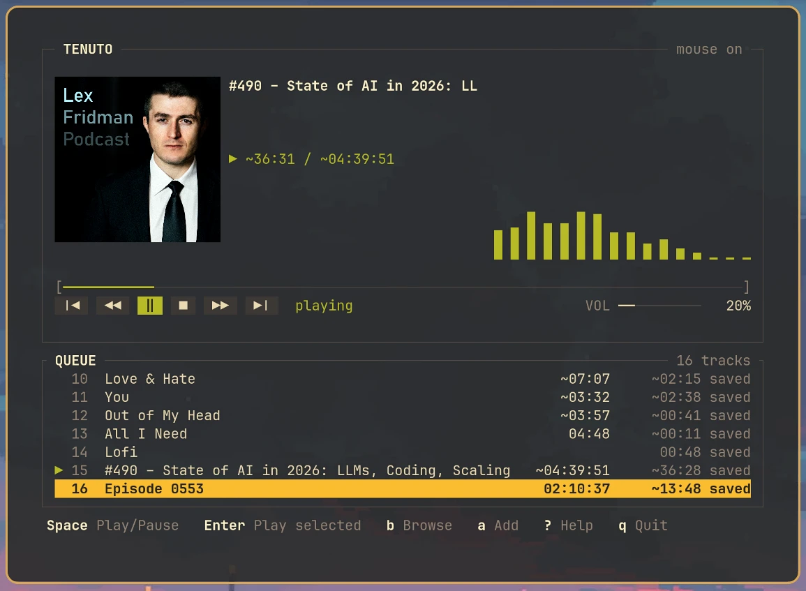

# Continuo

A keyboard-first terminal audio player for local files, finite HTTP media, and podcasts.

- Plays MP3, FLAC, WAV and M4A files, direct `http(s)://` URLs, and episodes of subscribed RSS or Atom feeds.
- Remembers where you stopped in every track, URL and episode, and resumes there.
- Seeks over HTTP with range requests, including MP3 podcasts with no seek index.
- Ships a full-screen terminal player with a persistent queue, a file and podcast browser, cover art and a spectrum display.
- Never plays, fetches or refreshes anything on its own. Every network request follows a key you pressed or a command you ran.



Milestones 0 through 6 are implemented. The automated suites pass. The manual terminal checks for the player and for feed management have not been run yet. [docs/m5-acceptance.md](docs/m5-acceptance.md) and [docs/m6-acceptance.md](docs/m6-acceptance.md) record them.

## Install

Continuo builds from source with Cargo.

1. Install Rust through rustup. The repository pins Rust 1.98.1 with the rustfmt and clippy components.
2. On Linux, install `libasound2-dev`. CPAL needs the ALSA headers. The runtime `libasound.so.2` alone is not enough.
3. Build from the repository root:

```sh
cargo build --release --locked
```

The binary is `target/release/continuo`. The examples below assume it is on your `PATH`.

## Quick start

```sh
continuo play ~/Music/episode.mp3
continuo play https://example.com/podcast/episode-42.mp3
continuo subscribe http://feeds.rucast.net/radio-t --as radio-t
continuo episodes radio-t -n 5
continuo play radio-t 3
continuo tui
```

## Commands

| Command | Action |
|---|---|
| `play <path-or-url>` | Play one file or URL with a status line and a few keys |
| `play <slug> <index>` | Play a subscribed feed's episode by its 1-based index |
| `play ... --probe-only` | Open the source, print what was found, and exit without a device or a terminal |
| `tui [--mouse on\|off] [--artwork auto\|blocks\|off]` | Open the full-screen player on the saved queue |
| `subscribe <url> [--as <slug>]` | Fetch a feed once, store the subscription, cache its episodes |
| `feeds` | List every subscription |
| `episodes <slug> [-n N] [--reverse]` | List a feed's cached episodes with your progress |
| `refresh [<slug>]` | Refresh one subscription, or all of them |
| `unsubscribe <slug>` | Remove a subscription and its cache. Checkpoints are kept |

`play` uses these keys: space pauses or resumes, the arrow keys seek, `s` stops, `p` plays, and `q` quits.

## Playing over HTTP

- A range-capable server can seek and resume. This includes MP3 files with no seek index, which is most podcasts.
- A range-less server plays through from the start. It cannot seek or resume.
- A live stream, or a source whose continuity cannot be established, is refused.
- A dropped connection fails. There is no automatic reconnection. Playing again makes one attempt to reopen at the preserved position.

### Seeking accuracy

A seek on MP3 computes a byte offset instead of scanning forward, which keeps a seek on a long podcast fast. A file with a Xing, Info or VBRI header lands exactly, or within a fraction of a second for variable-bitrate audio.

A file with no such header lands on a rough estimate. The landing can be in a substantially different part of the recording. On a worst-case 600-second variable-bitrate file, a seek to one third of the way through landed five seconds from the end. Constant-bitrate files without a header land exactly, but nothing in the file says which kind it is before the seek runs. Every landing on an index-less MP3 is therefore reported as an estimate, never as a confirmed position. Listings and the player show an estimate with a leading `~`.

## Terminal player

```sh
continuo tui [--mouse on|off] [--artwork auto|blocks|off]
```

`tui` restores the queue, the active entry, the volume and every checkpoint. It never starts playing on its own. No track is loaded and nothing is fetched until you press a playback key. Local files' tags and the active local entry's cover are read in the background. The audio device is created on the first load, so the player opens on a machine with no output device.

Options:

- `--mouse off` starts with mouse capture disabled and leaves the terminal's own selection and scrolling alone. `m` toggles it at any time. The default is `on`.
- `--artwork auto` asks the terminal which image protocol it supports and falls back to colored half-blocks after 250 ms without an answer. `blocks` always uses half-blocks. `off` never loads artwork and shows only the placeholder.
- Under tmux, `auto` and `blocks` run `tmux set -p allow-passthrough on` for the current pane. `off` avoids that.

The layout adapts to the terminal size. At 80 columns by 28 rows and above the player shows the cover, track information, spectrum, transport and progress above the queue. Below 80 columns or 28 rows it is compact. Below 50 columns or 18 rows it is minimal, with no cover and no spectrum. Below 30 columns or 8 rows it asks for a larger window, while space and `q` keep working. Either dimension alone drops a tier.

### Keys

| Key | Action |
|---|---|
| Space | Pause or resume. Before anything is loaded, load the restored active entry, or the selected row. After the last entry ended, replay it |
| Enter | Play the selected queue entry |
| Up, Down, `j`, `k` | Move the selection. Playback does not change |
| `J`, `K` | Move the selected entry down or up |
| Left, Right | Seek backward or forward 10 seconds. A burst of presses becomes one seek |
| Home | Restart the track from the beginning |
| `-`, `_`, `+`, `=` | Volume down or up by 5% |
| `s`, `p` | Stop, play |
| `[`, `]` | Previous or next queue entry. Never wraps |
| `d` | Remove the selected entry |
| `a` | Type a path or an `http(s)://` URL to enqueue |
| `c` | Clear the queue after a `y` confirmation |
| `b` | Open the browser |
| `?` | Show the key help |
| `m` | Toggle mouse capture |
| Ctrl-L | Redraw the screen and re-place the cover |
| Esc | Close the open overlay or cancel typing |
| `q`, Ctrl-C | Quit |

Ctrl-C quits and Ctrl-L redraws from anywhere, including while typing and inside overlays. Every other key belongs to what is open. While typing after `a`, printable keys are text, Enter enqueues and Esc cancels. The clear confirmation takes `y` and treats any other key as no. A Ctrl or Alt chord never fires a plain shortcut.

Seeking before anything is loaded answers `Play a track before seeking`. While a track is loading it answers `Still loading`. After the last entry ended, Left and Right answer `Track ended; press play to replay`. With an empty queue, the playback keys answer `Queue is empty`.

With mouse capture on, a click selects a queue row and a second click on the selected row plays it. The wheel moves the selection over the queue. The transport buttons act like their keys. A click on the progress bar seeks, only for a loaded track whose duration the decoder confirmed. The mouse does nothing while an overlay is open.

### The browser

`b` opens a browser with two tabs. Files shows one directory at a time, starting at the active local entry's directory or the directory `tui` started in. Podcasts shows the cached subscriptions.

| Key | Action |
|---|---|
| Up, Down, `j`, `k` | Move |
| Tab | Switch between Files and Podcasts |
| Enter | Open a directory or a feed. Enqueue a file or an episode. On a row already queued, remove it from the queue |
| Space | Mark several rows to enqueue together. Rows already queued are skipped |
| Backspace, Left | Go up one level |
| `a` (Podcasts) | Subscribe by URL |
| `r`, `R` (Podcasts) | Refresh the highlighted feed, or every feed |
| `d` (Podcasts) | Unsubscribe after a `y` confirmation |
| `b`, Esc | Close the browser |

A row already in the queue shows a green `✓`. A feed's episodes are listed newest first, with undated ones after the dated ones in feed order. `continuo episodes` keeps feed order, so its indices do not move. Directories are read one level at a time. Nothing indexes a library recursively.

Opening the browser never refreshes a feed. The Podcasts tab lists what was last cached. Updating it is an explicit act: `r` or `R` in the browser, or `continuo refresh` from a shell. Enqueueing or restoring a URL or an episode makes no network request. Only playing it does.

### The queue

Enqueueing appends and never changes what is playing. The queue is saved in `state.json` with the checkpoints and survives a restart. The same track may appear twice. Duplicates share one listening history but keep their own places. When a track ends, the next entry starts from its own resume point. A finished entry replays from the beginning. The last entry simply ends. There is no wrap, shuffle or repeat. A load that fails leaves the queue alone and waits for you.

The queue holds at most 256 occurrences. An enqueue that would go past that is refused whole with `Queue is full (256 entries)`. Checkpoints keep their own cap of 512 media. A queued track's history can still be evicted by enough other listening. The entry stays queued and then starts from zero.

A queue entry for a podcast episode remembers the episode, not a list position. Before loading it, the player looks the episode up in the local feed cache and uses its current enclosure. When the episode, the subscription or the cache is gone, it plays the URL it last saw and says `Using saved episode source`.

Before the active entry is loaded, the progress line and the queue rows show saved history, not a live position:

| Label | Meaning |
|---|---|
| `12:34 saved` | The checkpoint's resume point |
| `~12:34 saved` | An estimated resume point |
| `played` | Finished. Playing it starts from the beginning |
| `position unknown` | A checkpoint without a position |

### Cover art

A podcast episode's cover is the feed's `itunes:image`, the episode's own first, then the channel's, as recorded at the last refresh. It is downloaded only after playback has opened a network connection. A podcast with no feed image, and a plain URL entry, show the front cover embedded in the stream's own tag once the track is loaded. A local entry uses its embedded cover, then `cover.jpg`, `cover.png`, `folder.jpg` or `folder.png` beside it. Until then, and when there is none, the placeholder shows.

### Saving, quitting and signals

`q` and Ctrl-C exit 0. SIGINT, SIGHUP and SIGTERM, including a closing pane or window, capture and flush the final position, restore the terminal, and exit with `128 + signal number`. `continuo play` follows the same contract. A flush that fails is reported as `State was not saved: ...` after the terminal is restored. SIGKILL, a crash or power loss keep only the last completed write.

A write that fails while the player runs shows `not saving` in the header until a later write succeeds. If the state file cannot be repaired safely at startup, the session runs unsaved and shows `unsaved`.

### Logs

While `tui` runs, everything written to standard error goes to a new log file instead of the screen:

```text
$XDG_STATE_HOME/continuo/logs/continuo-tui-<UTC timestamp>-<pid>.log
```

Each run creates its own file and keeps the five most recent earlier ones. `RUST_LOG=continuo=debug continuo tui` works as usual and lands in that file. A crash prints its panic message on the restored terminal.

## Podcasts

```sh
continuo subscribe http://feeds.rucast.net/radio-t --as radio-t
continuo feeds
continuo episodes radio-t -n 5
continuo episodes web-standarts --reverse -n 5
continuo play radio-t 3
continuo refresh radio-t
continuo refresh
continuo unsubscribe radio-t
```

`subscribe` fetches the feed once, stores the subscription, and caches the episodes. Everything after that reads the cache. `feeds`, `episodes` and `play` never touch the network for feed data, so they work offline. Nothing refreshes on its own. A feed's episode list changes only when you run `refresh`. There is no background poller, no refresh on listing, and no retry loop.

There is no offline audio. Only the episode list is cached. Playing an episode streams its enclosure over HTTP every time.

### Listing

```text
$ continuo feeds
SLUG        EPISODES  REFRESHED (UTC)   TITLE
radio-t            4  2026-09-11 18:33  Радио-Т

$ continuo episodes radio-t
  #  PROGRESS            AUDIO  PUBLISHED (UTC)  TITLE
  1  23:14               -      2026-09-06       Радио-Т 987
  2  ~18:02 / (1:42:00)  -      2026-08-30       Радио-Т 986
  3  played              -      2026-08-23       Радио-Т 985
  4  position unknown    none   2026-08-09       Bonus: outtakes
```

Every timestamp is UTC. No local conversion is attempted.

`PROGRESS` has five states:

| Cell | Meaning |
|---|---|
| `—` | No checkpoint. This episode has never been opened |
| `23:14` | A decoder-confirmed resume point |
| `~18:02` | An estimated position left by a byte-offset seek on an index-less MP3 |
| `played` | Finished. Reopening starts from the beginning |
| `position unknown` | A checkpoint exists but carries no position |

`/ (1:42:00)` beside a position is the feed's own `itunes:duration` claim. It is in parentheses because nothing has verified it. `AUDIO: none` means the item has an identity but no usable enclosure, so there is nothing to play.

A subscription whose cache file has gone shows `—` episodes and `never`, and `feeds` exits zero for it. A cache that exists but cannot be read is an error. See [When the cache is unusable](#when-the-cache-is-unusable).

A state file that cannot be read fails the listing instead of printing every episode as unplayed.

### Indices

Episode indices are 1-based and follow feed order, never a sort by date or title. `-n 5` changes how many rows are displayed, never what an index means. `--reverse` starts from the end of the feed, and `-n` then counts from the end. Every row keeps its index, so `play` resolves the number you read. Indices renumber only when a `refresh` replaces the cache.

Feeds are not all ordered the same way. Radio-T lists its newest episode first. Some feeds list their oldest first, so `--reverse -n 5` shows their five newest.

### Slugs

`--as <slug>` names a subscription explicitly. A slug is 1 to 32 ASCII lowercase letters, digits or hyphens. An explicit slug that is taken is refused.

Without `--as`, the slug comes from the feed's title. ASCII letters are lowercased and kept, digits are kept, and every other run of characters collapses to one `-`. No transliteration is attempted. A title in a non-ASCII script yields nothing, and the slug falls back to the feed URL's host with a leading `www.` stripped. `Радио-Т` at `https://radio-t.com/rss/` becomes `radio-t-com`. A derived slug that collides takes the first free `-2`, `-3` suffix within 32 characters.

### Refreshing and exit status

`refresh <slug>` updates one subscription. `refresh` with no slug updates every one in order, with no concurrency and no retries. Both send a conditional request when a usable cache exists, so an unchanged feed costs a 304.

```text
$ continuo refresh
radio-t: updated, 412 episodes retained, 3 skipped
sysdesign: failed: network error while Open: ...
continuo: 1 of 2 feeds did not complete successfully
```

A batch prints every feed, then exits nonzero if any of them did not complete. The rule is general: a partial success never exits zero. `subscribe`, `unsubscribe` and `refresh` each commit in two steps across two files. When the second step fails, the command says exactly what did and did not happen and exits nonzero. Read the line before trusting the status.

### When the cache is unusable

```text
continuo: no cached episodes for radio-t; run continuo refresh radio-t
continuo: corrupt cache for radio-t: cache file is malformed (syntax error at line 1, column 2); run continuo refresh radio-t
continuo: cache parser 99 differs from 1 for radio-t; run continuo refresh radio-t
```

All three name the same recovery. The cache is refetchable data, and `refresh` rebuilds it unconditionally when it is missing, corrupt, or stamped by a parser this build does not recognize. A corrupt file is left where it is. Listing a feed never rewrites, quarantines or deletes anything.

### Identities

A podcast episode and a direct URL are different things to Continuo, even when the bytes are identical. `continuo play radio-t 3` checkpoints the episode: the feed's identity plus the item's GUID, or its enclosure URL, or its link, in that order. `continuo play https://cdn.example.org/987.mp3` checkpoints the URL. Progress does not carry from one to the other.

An item with a GUID keeps its position when the show moves its audio to another CDN. An item with no GUID takes its identity from the enclosure URL, so a move loses its position.

`unsubscribe` removes the subscription and its cache and keeps every checkpoint. Resubscribing mints a new feed identity, so those checkpoints are orphaned and the episodes show as unplayed again. Reattaching would require trusting a feed URL to mean the same feed forever.

### Feed-format limits

- RSS 2.0 and Atom 1.0 only. RSS 1.0 is refused by name. JSON Feed is not supported.
- Bytes decide the encoding. A document that will not decode is refused, not repaired.
- Item titles are display text. An Atom `title[type=html]` is decoded once and then kept literally, markup and all. HTML entities that are not XML entities survive as text.
- A publication date is read as RFC 2822, plus the `UTC` zone spelling real feeds use. A date that will not parse leaves `PUBLISHED` as `—` and keeps the episode.
- An item with no GUID, no enclosure and no link has no identity and is skipped and counted.
- An item with an identity but no usable enclosure is kept and listed with `AUDIO: none`.

## Files and state

| Location | Contents |
|---|---|
| `$XDG_STATE_HOME/continuo/state.json` | Checkpoints, volume, the queue and its active entry |
| `$XDG_STATE_HOME/continuo/state.lock` | The player lock. Empty, never deleted |
| `$XDG_STATE_HOME/continuo/logs/` | One log per `tui` run. The five most recent earlier ones are kept |
| `$XDG_DATA_HOME/continuo/subscriptions.json` | Subscriptions. Durable user data |
| `$XDG_DATA_HOME/continuo/subscriptions.lock` | The subscription writer lock |
| `$XDG_CACHE_HOME/continuo/feeds/<feed-id>.json` | Cached episodes. Refetchable |

On macOS and Windows these resolve to the platform's own data, cache and local-data directories. The cache and the logs are disposable. Subscriptions and checkpoints are not.

### Playback state

`state.json` holds one checkpoint per media identity, capped at 512 entries, plus the queue. It is replaced atomically, so a crash mid-write cannot leave a truncated file. Reaching the end of a track marks it complete. Reopening a completed track starts from the beginning.

A file this build cannot read is preserved. Garbage is moved aside as `state.json.rejected-<timestamp>`. A file from a newer build is left where it is, with writing disabled for that session. If only the queue part is damaged, only the queue is reset. The original bytes are copied to `state.json.queue-recovery-<timestamp>` first, and the player says what was reset.

Deleting `state.json` forgets every remembered position. There is no supported way to edit it by hand. A checkpoint key this build cannot parse makes the whole file unreadable.

### One player per profile

`continuo tui` and `continuo play` take an exclusive lock on `state.lock` before they read any playback state. A second player on the same profile refuses to start before it opens an audio device or touches the terminal:

```text
continuo: Another Continuo player is using this state profile
```

Feed commands and `play --probe-only` take no player lock and can run beside a player. Every subscription change, from the CLI or from the player's browser, holds `subscriptions.lock` for its whole duration. A second one refuses at once with `Another subscription update is in progress`.

## Development

```sh
cargo run --locked -- play <path-or-url>
cargo run --locked -- tui
RUST_LOG=continuo=debug cargo run --locked -- play <path-or-url>
cargo fmt --check
cargo clippy --locked --all-targets --all-features -- -D warnings
cargo test --locked
```

Dependency versions are recorded in the committed `Cargo.lock`. Runtime code forbids unsafe code and denies `unwrap` and `expect`. Tests may use them for assertions and fixtures. `CONTINUO_AUDIO_OUTPUT=null` runs the player against a paced virtual output on a machine with no sound device. It is a test switch, not user configuration.

Read the [architecture](docs/architecture.md) for the C4 views, the execution contexts and the contracts. The design specs live under [docs/superpowers/specs/](docs/superpowers/specs/), starting with the [foundation spec](docs/superpowers/specs/2026-09-07-continuo-foundation-design.md). Known limitations: non-UTF-8 local paths are unsupported, position is an estimate when device latency is unavailable, and seek support may stay unknown until probed.
